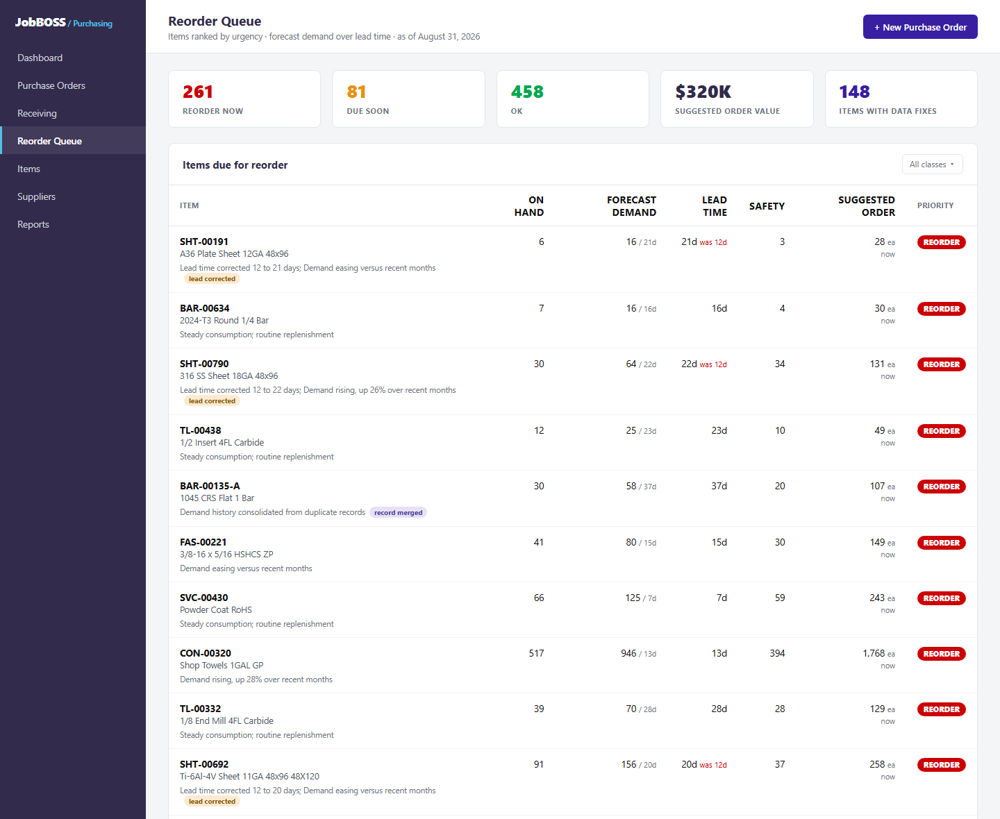
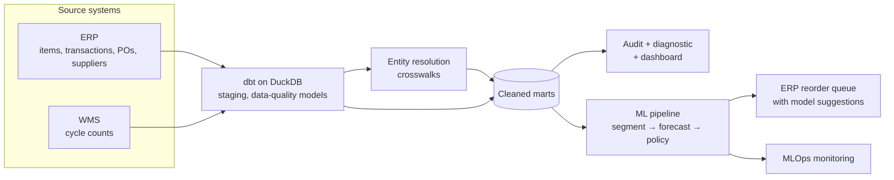

# Manufacturing Data Platform: Inventory Forecasting & ERP Data Quality

**An end-to-end data platform for a mid-sized manufacturer, spanning data engineering, analytics and machine learning, applied to inventory forecasting and ERP data quality.**

It starts with a **data pipeline** that integrates item, transaction, purchasing and supplier records, resolves duplicate items and stale reference data, and models it into clean marts.

An **analytics and ML layer** is then built on top of that cleaned dataset, including:

1. **Data quality audit** that quantifies every defect in the item master and the operational cost it carries
2. **Analytics diagnostics** that show where inventory dollars sit and what a corrected, forecast-driven policy would change
3. **Machine learning model** that forecasts each item's demand over its lead time and turns it into reorder suggestions, supported by technical documentation and MLOps monitoring in production

The demand model's reorder suggestions are embedded into the company's existing ERP purchasing screen, as shown below:

[](https://brimsystems.github.io/mfg-inventory-forecast/docs/index.html)

> **[Open the live reorder queue &rarr;](https://brimsystems.github.io/mfg-inventory-forecast/docs/index.html)** &nbsp;·&nbsp; **[All seven deliverables &rarr;](https://brimsystems.github.io/mfg-inventory-forecast/)**

---

## Business Context

A precision machining shop (~$25M revenue, three buyers, about 800 active purchased items) ran purchasing on reorder points set in the ERP years ago and rarely revisited. Buyers kept their own spreadsheets because they did not trust the on-hand numbers. Expedite fees and stockouts on common material were frequent while slow-moving stock accumulated, and nobody could say how much inventory the shop actually needed.

The data that could fix this was already being captured, but the item master was dirty. The same physical item existed under two or three numbers, so its consumption history split in half and each half looked too sparse to forecast. Lead times recorded at item creation had drifted upward for one supplier without ever being updated. Boxes were purchased but issued by the each with no conversion, one vendor was fragmented across three spellings and two IDs, and a share of records were missing a reorder point, a cost, or a supplier.

Resolving the duplicate records, recalculating lead times from actual receipts, and forecasting demand over each item's true lead time turns that mess into a right-sized reorder policy. The shop can now see what to order and how much, which losses are worth fixing first, and how much working capital a forecast-driven policy frees at the same service level.

---

## Deliverables

| # | Deliverable | What it is | Links |
|---|---|---|---|
| 1 | ERP reorder queue | The demand model embedded in a JobBOSS-style purchasing screen: each item's forecast demand over its lead time, on-hand, suggested order and reason, with merged records and corrected lead times flagged. | [View](https://brimsystems.github.io/mfg-inventory-forecast/docs/index.html) |
| 2 | Data quality audit | Every defect class in the item master, the records affected, the evidence, and the operational cost, ending in the remediation performed. | [View](https://brimsystems.github.io/mfg-inventory-forecast/docs/reports/data_quality_audit.html) |
| 3 | Analytics diagnostic report | Where inventory dollars sit, the demand-pattern distribution, supplier lead-time performance, and the three-policy comparison of service and working capital. | [View](https://brimsystems.github.io/mfg-inventory-forecast/docs/reports/analytics_report.html) |
| 4 | KPI dashboard | The recurring view of inventory value and turns, fill rate, stockouts, expedites and supplier lead time, by week and month. | [View](https://brimsystems.github.io/mfg-inventory-forecast/docs/reports/dashboard.html) |
| 5 | ML model overview & performance report | A high-level model card: what the model predicts over the lead time, how it performs by segment against the baselines, and the working capital it helps unlock. | [View](https://brimsystems.github.io/mfg-inventory-forecast/docs/reports/model_overview.html) |
| 6 | ML technical report | Demand segmentation, feature engineering, the rolling-origin backtest, metric choices, results by segment and ABC, and the safety-stock calibration. | [View](https://brimsystems.github.io/mfg-inventory-forecast/docs/reports/technical_report.html) |
| 7 | MLOps monitoring report | Monitoring across periods on four drift layers with a rules-based retraining decision. | [View](https://brimsystems.github.io/mfg-inventory-forecast/docs/reports/monitoring_report.html) |

---

## How it works



Raw extracts from the ERP and the warehouse are typed in dbt staging, run through first-class data-quality models (one per defect class), and combined into cleaned marts. Entity resolution merges duplicate items through an auditable crosswalk (nothing is deleted), and lead times are recalculated from actual receipts. The marts feed the audit and diagnostic reports and the ML pipeline: items are classified by demand pattern, a global model forecasts demand over each item's lead time, and an inventory policy simulation turns forecast accuracy into service and working capital. Each period is monitored against training references.

---

## Results

All figures below are read directly from the pipeline in this repository.

- **Data quality:** the item master resolved from 855 records to 800 physical items at 100% precision and 100% recall on the known duplicate clusters (365 genuinely similar pairs correctly held apart). One supplier's recorded lead time (12 days) understated its actual receipts, which had drifted toward 27 days on about 120 items; the duplicate records had split roughly $718K of annual consumption across separate numbers; one vendor's spend was fragmented across two IDs.
- **Forecast:** three candidates were tuned and compared; the gradient-boosted model was selected. Against the moving average the shop effectively uses, WAPE falls from about 70% to 41%. Against each demand segment's best statistical baseline, the model adds about 6% overall, winning clearly on the erratic and calendar-driven items and, reported honestly, ceding the intermittent items where a simple method is the right call. Merging the duplicate records improves forecast accuracy on those items from about 27% to 21% WAPE.
- **Inventory:** at an equal ~97% service level, the forecast-driven policy holds about $438K (31%) less inventory than a corrected policy without a forecast. Against the current stale reorder points, it lifts fill rate from 89% to 97% and cuts expedite cost from about $299K to $117K. Expedite and carrying costs are stated assumptions.
- **Monitoring:** across the three monitored periods the model held within every threshold, so the standing decision is no action.

---

## Data

The datasets were generated to represent typical records from a manufacturing ERP and warehouse, with defect types and rates constructed to reflect patterns commonly documented in these systems, so the full workflow can be demonstrated on data that is safe to share publicly; the [generators are in `data_source/generate/`](data_source/generate/).

---

## Running it locally

```bash
# 1. Environment
python3 -m venv .venv
source .venv/bin/activate          # Windows: .venv\Scripts\activate
pip install -e .

# 2. Generate the source data
python3 -m data_source.generate.run_generator

# 3. Entity resolution (writes the crosswalk seeds), then build the warehouse
python3 -m ml.src.resolution
cd data_pipeline && dbt build && cd ..

# 4. Data quality, marts, forecasting and policy
python3 -m ml.src.data_quality
python3 -m ml.src.marts
python3 -m ml.src.baselines
python3 -m ml.src.training
python3 -m ml.src.scoring
python3 -m ml.src.policy
python3 -m ml.src.monitoring

# 5. Client-facing deliverables
python3 -m ml.reports.generate_reorder_queue
python3 -m ml.reports.generate_data_quality_audit
python3 -m ml.reports.generate_analytics_report
python3 -m ml.reports.generate_dashboard
python3 -m ml.reports.generate_model_overview
python3 -m ml.reports.generate_technical_report
python3 -m ml.reports.generate_monitoring_report
```

The report generators write standalone HTML; the copies served by GitHub Pages live under [`docs/`](docs/).

---

## Stack

| Layer | Tools |
|---|---|
| Integration & transformation | dbt, DuckDB |
| Data quality & entity resolution | Python, dbt models, string similarity + blocking |
| Analytics & reporting | Python, pandas, matplotlib, HTML/CSS |
| Modeling | XGBoost, scikit-learn, Optuna, SHAP, Croston/SBA baselines |
| MLOps | MLflow, Evidently, Prefect |
| Delivery | Static HTML, GitHub Pages |

---

Brian Davis, fractional data engineering and analytics partner for SMB manufacturers &middot; brian@brimsystems.com
